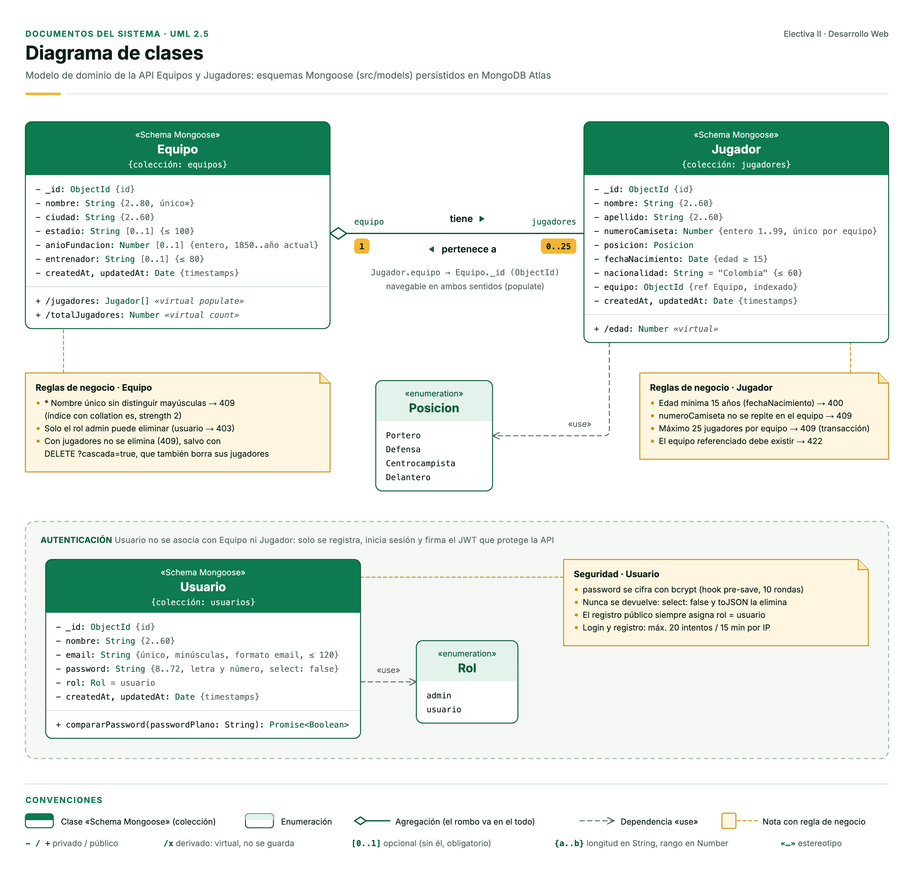
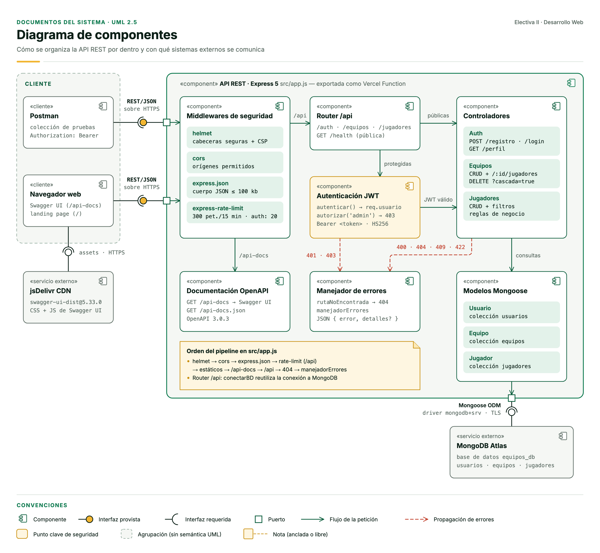
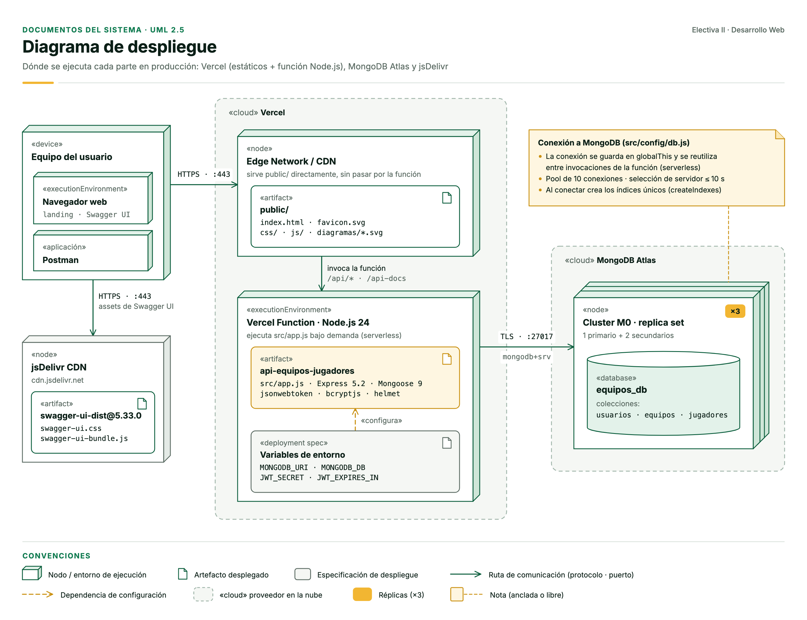

# ⚽ API Equipos y Jugadores

API RESTful construida con **Node.js + Express 5 + Mongoose** para gestionar **equipos de fútbol** y sus **jugadores**: una relación **uno a muchos** (un equipo tiene muchos jugadores; cada jugador pertenece a un solo equipo). Los datos se persisten en **MongoDB Atlas**, los endpoints se protegen con **JSON Web Tokens (JWT)**, la documentación está en **Swagger (OpenAPI 3)** y el servicio se despliega en **Vercel**.

> Taller API RESTful · Electiva II – Desarrollo Web · Rafael Cristancho · 2026

| | |
|---|---|
| 🌐 **URL de la API** | **https://api-equipos-jugadores.vercel.app** |
| 📘 **Swagger** | https://api-equipos-jugadores.vercel.app/api-docs |
| 📄 **OpenAPI JSON** | https://api-equipos-jugadores.vercel.app/api-docs.json |
| ❤️ **Estado** | https://api-equipos-jugadores.vercel.app/api/health |
| 💻 **Código** | https://github.com/RafaelC26/TallerElectivaII |

---

## Contenido

1. [Modelo de datos (relación 1:N)](#1-modelo-de-datos-relación-1n)
2. [Arquitectura](#2-arquitectura)
3. [Endpoints](#3-endpoints)
4. [Reglas de negocio](#4-reglas-de-negocio)
5. [Seguridad](#5-seguridad)
6. [Estructura del proyecto](#6-estructura-del-proyecto)
7. [Ejecución local](#7-ejecución-local)
8. [Pruebas automáticas](#8-pruebas-automáticas)
9. [Despliegue en Vercel + MongoDB Atlas](#9-despliegue-en-vercel--mongodb-atlas)

---

## 1. Modelo de datos (relación 1:N)



| Colección | Documento | Relación |
|---|---|---|
| `equipos` | `nombre` (único), `ciudad`, `estadio`, `anioFundacion`, `entrenador` | **1** equipo → **N** jugadores (virtual `jugadores` y conteo `totalJugadores` con *populate*) |
| `jugadores` | `nombre`, `apellido`, `numeroCamiseta` (1–99), `posicion`, `fechaNacimiento`, `nacionalidad`, **`equipo` (ObjectId → Equipo)** | cada jugador referencia a su equipo |
| `usuarios` | `nombre`, `email` (único), `password` (hash bcrypt), `rol` (`admin` \| `usuario`) | autenticación, sin relación con el dominio |

En Mongoose la relación se modela guardando la referencia en el lado "muchos" (`Jugador.equipo`, con índice) y declarando en `Equipo` un **virtual populate**, así que no hay arreglos que crezcan sin límite dentro del equipo:

```js
// src/models/Jugador.js
equipo: { type: mongoose.Schema.Types.ObjectId, ref: 'Equipo', required: true, index: true }

// src/models/Equipo.js
equipoSchema.virtual('jugadores', { ref: 'Jugador', localField: '_id', foreignField: 'equipo' });
```

## 2. Arquitectura

**Diagrama de componentes**



**Diagrama de despliegue**



El flujo de cada petición es: `helmet → cors → express.json → rate-limit → router /api → conexión a BD (cacheada) → autenticar (JWT) → autorizar (rol) → controlador → modelo Mongoose → MongoDB Atlas`. Cualquier error llega a un **manejador central** que siempre responde JSON con el formato `{ "error": "...", "detalles": [...] }`.

## 3. Endpoints

| Método | Ruta | Descripción | Acceso |
|---|---|---|---|
| `GET` | `/api` | Nombre, versión y recursos de la API | Público |
| `GET` | `/api/health` | Estado del servicio y de la base de datos | Público |
| `POST` | `/api/auth/registro` | Registrar usuario (siempre con rol `usuario`) → token | Público |
| `POST` | `/api/auth/login` | Iniciar sesión → token JWT | Público |
| `GET` | `/api/auth/perfil` | Usuario autenticado | JWT |
| `GET` | `/api/equipos` | Listar equipos (`?nombre=&ciudad=&pagina=&limite=`) | JWT |
| `POST` | `/api/equipos` | Crear equipo | JWT |
| `GET` | `/api/equipos/{id}` | Obtener equipo **con sus jugadores** | JWT |
| `PUT` | `/api/equipos/{id}` | Actualizar equipo (solo los campos enviados) | JWT |
| `DELETE` | `/api/equipos/{id}` | Eliminar equipo (`?cascada=true` elimina también sus jugadores) | JWT · **admin** |
| `GET` | `/api/equipos/{id}/jugadores` | Jugadores de un equipo (relación 1:N) | JWT |
| `GET` | `/api/jugadores` | Listar jugadores (`?equipo=&posicion=&nombre=&pagina=&limite=`) | JWT |
| `POST` | `/api/jugadores` | Crear jugador en un equipo | JWT |
| `GET` | `/api/jugadores/{id}` | Obtener jugador con los datos de su equipo | JWT |
| `PUT` | `/api/jugadores/{id}` | Actualizar o **transferir** jugador (cambiando `equipo`) | JWT |
| `DELETE` | `/api/jugadores/{id}` | Eliminar jugador | JWT · **admin** |

**Formato de respuestas**

```jsonc
// Listas
{ "datos": [ ... ], "paginacion": { "total": 16, "pagina": 1, "limite": 10, "paginas": 2 } }
// Un recurso
{ "datos": { ... } }
// Crear / actualizar / eliminar
{ "mensaje": "Jugador creado correctamente", "datos": { ... } }
// Errores
{ "error": "Datos inválidos", "detalles": [ { "campo": "numeroCamiseta", "mensaje": "El número de camiseta debe estar entre 1 y 99" } ] }
```

**Códigos de estado:** `200` OK · `201` creado · `400` datos inválidos o id mal formado · `401` sin token, token inválido o vencido · `403` rol sin permiso · `404` no existe · `409` conflicto con una regla de negocio · `413` cuerpo demasiado grande · `415` contenido no soportado · `422` el equipo referenciado no existe · `429` demasiadas peticiones · `503` base de datos no disponible.

**Ejemplo rápido con curl**

```bash
# 1) Login
curl -X POST https://api-equipos-jugadores.vercel.app/api/auth/login -H "Content-Type: application/json" \
     -d '{"email":"rafael@correo.com","password":"Clave2026"}'

# 2) Usar el token
curl https://api-equipos-jugadores.vercel.app/api/equipos -H "Authorization: Bearer <token>"
```

## 4. Reglas de negocio

| # | Regla | Dónde se valida | Respuesta |
|---|---|---|---|
| 1 | No pueden existir dos equipos con el mismo nombre (sin distinguir mayúsculas) | Índice único con *collation* `es`, fuerza 2 | `409` |
| 2 | Todo jugador pertenece a un equipo **existente** | Controlador (`validarReglasDeNegocio`) | `422` |
| 3 | El número de camiseta (1–99) es **único dentro de cada equipo** | Controlador + índice único compuesto `{equipo, numeroCamiseta}` | `409` |
| 4 | Un equipo admite como máximo **25 jugadores** (también al transferir) | Controlador, dentro de una **transacción** | `409` |
| 5 | Un jugador debe tener **al menos 15 años** (fecha real `AAAA-MM-DD`) | Validador y *setter* estricto del esquema | `400` |
| 6 | Un equipo con jugadores no se elimina, salvo en cascada (`?cascada=true`) | Controlador, dentro de una **transacción** | `409` |
| 7 | Solo el rol **admin** puede eliminar equipos y jugadores | Middleware `autorizar('admin')` | `403` |
| 8 | El registro público siempre crea usuarios con rol `usuario` | Controlador (lista blanca de campos) | — |

**¿Por qué transacciones?** Contar los jugadores y después guardar son dos pasos. Si llegan dos altas al mismo tiempo a un equipo con 24 jugadores, las dos verían "24" y quedarían 26. Por eso cada alta, transferencia o borrado de equipo corre en una **transacción de MongoDB** que primero "toca" el documento del equipo. Si dos operaciones van al mismo equipo chocan (`WriteConflict`) y MongoDB las reintenta una después de otra. Así el cupo de 25 y la regla de "equipo existente" se cumplen aunque las peticiones lleguen simultáneas (hay pruebas automáticas que lo comprueban).

## 5. Seguridad

- **JWT (HS256)** con emisor (`iss`), sujeto (`sub` = id del usuario) y expiración configurable (`JWT_EXPIRES_IN`, por defecto 2 h). El algoritmo se fija al verificar, así que se rechazan tokens `alg: none` o firmados con otro algoritmo. Si `JWT_SECRET` tiene menos de 32 caracteres o es el valor de ejemplo, la API se niega a emitir tokens y `/api/health` lo reporta.
- En cada petición se comprueba que **el usuario del token siga existiendo**.
- **Contraseñas con bcrypt** (10 rondas) y política mínima: 8 caracteres, con letras y números, y como máximo 72 bytes (el límite real de bcrypt). El hash nunca se devuelve (`select: false` y transformación `toJSON`).
- **Sin enumeración de usuarios**: el login responde con el mismo mensaje y el mismo tiempo exista o no el email (se compara contra un hash ficticio), y el registro valida todos los datos antes de revisar si el email existe.
- **Roles** `admin` / `usuario` con el middleware `autorizar(...)`.
- **Rate limiting**: 20 intentos cada 15 min en `/api/auth/*` y 300 peticiones cada 15 min en `/api`, por IP. Solo en Vercel se confía en el proxy (`trust proxy`), así que nadie puede saltarse el límite falsificando `X-Forwarded-For`.
- **`npm run seed` nunca asciende una cuenta existente** a administrador: si alguien se registró antes con `ADMIN_EMAIL`, el seed se detiene.
- **Protección contra inyección NoSQL**: `sanitizeFilter` de Mongoose, validación de tipos en el login y búsquedas con expresiones regulares escapadas.
- **Lista blanca de campos** en cada creación o actualización, para evitar la asignación masiva (`rol`, `_id`...).
- **helmet** (cabeceras seguras + Content-Security-Policy), CORS configurable y límite de 100 KB en el cuerpo JSON.
- **Errores controlados**: los errores del cliente responden 4xx (400, 413 o 415) y una caída de la base de datos responde 503. Nunca se devuelven trazas internas.
- Los secretos viven en variables de entorno (`atlas-credentials.env` y `.env` en local, *Environment Variables* en Vercel) y están en `.gitignore`.

## 6. Estructura del proyecto

```
Taller/
├── src/
│   ├── app.js                 # App Express (punto de entrada en Vercel)
│   ├── server.js              # Arranque local (npm run dev)
│   ├── config/
│   │   ├── env.js             # Carga atlas-credentials.env + .env
│   │   └── db.js              # Conexión a MongoDB con caché (serverless)
│   ├── models/                # Usuario, Equipo, Jugador (Mongoose)
│   ├── controllers/           # auth, equipos, jugadores
│   ├── routes/                # /api, /api/auth, /api/equipos, /api/jugadores
│   ├── middlewares/           # autenticar/autorizar (JWT), validarId, errores
│   ├── utils/                 # ApiError, jwt, paginación y filtros
│   └── docs/                  # openapi.js (especificación) y swagger.js (UI)
├── public/                    # Página de inicio y diagramas (servidos por la CDN)
├── scripts/seed.js            # Crea el admin y datos de ejemplo
├── tests/                     # Pruebas de integración (node:test + supertest)
└── docs/diagramas/            # Diagramas en SVG y PNG
```

## 7. Ejecución local

Requisitos: **Node.js 20.19 o superior** y un cluster de **MongoDB Atlas** (el plan gratuito M0 sirve).

```bash
npm install
```

1. Coloque en la raíz el archivo **`atlas-credentials.env`** que genera Atlas (contiene `MONGODB_URI`).
2. Copie `.env.example` como **`.env`** y complete `JWT_SECRET` y los datos del administrador. Si una variable está en ambos archivos, gana `atlas-credentials.env`.
3. Cargue el administrador y los datos de ejemplo, y arranque el servidor:

```bash
npm run seed    # admin + 5 equipos y 16 jugadores de ejemplo
npm run dev     # http://localhost:3000  ·  Swagger en http://localhost:3000/api-docs
```

`npm run seed -- --reset` borra y vuelve a crear los equipos y jugadores (los usuarios no se tocan).

| Variable | Obligatoria | Descripción |
|---|---|---|
| `MONGODB_URI` | ✅ | Cadena `mongodb+srv://` de Atlas |
| `MONGODB_DB` | | Nombre de la base de datos (por defecto `equipos_db`) |
| `JWT_SECRET` | ✅ | Secreto para firmar los tokens (≥ 32 caracteres aleatorios) |
| `JWT_EXPIRES_IN` | | Vigencia del token (por defecto `2h`) |
| `CORS_ORIGIN` | | Orígenes permitidos (por defecto `*`) |
| `PORT` | | Puerto local (por defecto `3000`) |
| `ADMIN_NOMBRE`, `ADMIN_EMAIL`, `ADMIN_PASSWORD` | | Administrador que crea `npm run seed` |

## 8. Pruebas automáticas

```bash
npm test
```

**144 pruebas de integración** (node:test + supertest) contra un MongoDB en memoria (**mongodb-memory-server**, como *replica set* para poder usar transacciones), así que no tocan Atlas. Cubren:

- Autenticación y ataques con tokens: vencidos, `alg: none`, otro secreto, usuario eliminado o rol falsificado.
- El CRUD completo de equipos y jugadores, con filtros, paginación y orden alfabético en español.
- Todas las reglas de negocio, incluidas **peticiones simultáneas** (cupo de 25 y jugadores huérfanos).
- Inyección NoSQL, asignación masiva, cuerpos gigantes, charset no soportado y fechas imposibles.
- La especificación OpenAPI, y que cada ruta de Express esté documentada en Swagger.

## 9. Despliegue en Vercel + MongoDB Atlas

1. **Atlas → Network Access → Add IP Address → Allow access from anywhere (`0.0.0.0/0`)**. Vercel no tiene IP fija.
2. **Vercel → proyecto → Settings → Environment Variables** (entorno *Production*): `MONGODB_URI`, `JWT_SECRET` y, si se quiere, `MONGODB_DB` y `JWT_EXPIRES_IN`.
3. **Settings → Deployment Protection**: dejar la URL de producción pública (*Standard Protection*). Si la protección cubre también producción, los visitantes ven un login de Vercel.
4. Desplegar (`npx vercel deploy --prod`). Vercel detecta Express automáticamente y usa `src/app.js` (que exporta la app). La carpeta `public/` la sirve directamente su CDN. `.vercelignore` impide que se suban `.env`, `atlas-credentials.env` y `node_modules`.
5. Comprobar `https://<proyecto>.vercel.app/api/health` → `{"estado":"ok","baseDatos":"conectado"}`.

Los archivos `.env` y `atlas-credentials.env` **no se suben** ni al repositorio ni a Vercel.
